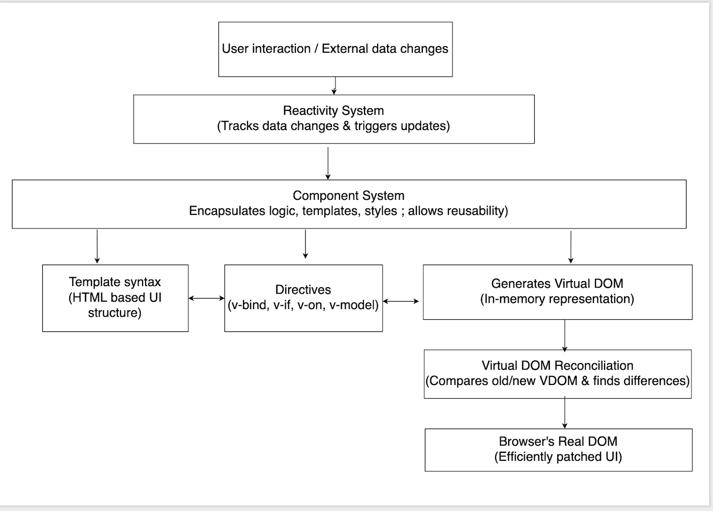

## What is Vue? ##

Vue (pronounced /vjuː/, like view) is an open source, progressive JavaScript framework for building user interfaces. 

### What is a progressive framework? ###

The advantages of progressive frameworks are:

- **Flexibility**: Developers can choose the parts of the framework that meet their needs instead of incurring unnecessary overhead.

- **Lightweight**: Progressive frameworks tend to use less storage space and resources than monolithic alternatives.

- **Quick start**: They enable a quick start and allow developers to concentrate on the essentials.

- **Extensibility**: As requirements change, developers can extend the framework to meet their new needs.
 for building user interfaces.
 
Vue  builds on top of standard HTML, CSS, and JavaScript and provides a declarative, component-based programming model that helps you efficiently develop user interfaces of any complexity.

## What can I do with Vue? ##

Here's a breakdown of what you can do with Vue.js:

1.  **Build Interactive User Interfaces (UIs):**
    - **Dynamic Content:** Update parts of a webpage without full reloads, like real-time dashboards, stock tickers, or social media feeds.
    - **Forms and Inputs:** Create complex forms with validation, dynamic fields, and immediate feedback.
    - **Animations and Transitions:** Easily add smooth animations and transitions to UI elements for a more engaging user experience.
    - **Interactive Components:** Build reusable UI components like carousels, modals, accordions, tabs, and more.

2.  **Develop Single-Page Applications (SPAs):**
    - SPAs load a single HTML page and dynamically update content as the user navigates, providing a fast and fluid user experience similar to a desktop application.
    - **Examples:** Dashboards, project management tools, email clients, social media feeds, and many modern web applications.

3.  **Create Progressive Web Apps (PWAs):**
    - Vue.js can be used to build PWAs, which are web applications that offer a native app-like experience (offline capabilities, push notifications, home screen icon) while still being accessible via a web browser.
    - **Tools:** Libraries like `workbox` (often integrated with Vue CLI or Vite) help you set up service workers for offline functionality.

4.  **Develop Full-Stack Applications (with Server-Side Rendering - SSR):**
    - While Vue.js is primarily a frontend framework, you can use it with a Node.js framework like **Nuxt.js** (a meta-framework built on Vue.js) to enable Server-Side Rendering (SSR).
    - **Benefits of SSR:** Improved SEO (search engine optimization) for content-heavy sites, faster initial page load times, and better performance on slower networks or devices.
    - **Use Cases:** E-commerce sites, content management systems (CMS), news sites, and other applications where SEO is critical.

5.  **Build Static Site Generated (SSG) Websites:**
    - Similar to SSR, Nuxt.js (or tools like VuePress) can generate static HTML files for your Vue application at build time.
    * **Benefits of SSG:** Extremely fast loading times, excellent SEO, and reduced server costs as the content is pre-rendered.
    * **Use Cases:** Blogs, documentation sites, marketing websites, portfolios.

6.  **Enhance Existing Websites (Progressive Enhancement):**
    - You can add small, interactive Vue components to existing HTML pages to bring specific sections to life.
    - **Use Cases:** Adding a dynamic shopping cart to a static e-commerce site, an interactive comment section to a blog, or a complex filter/search interface to a legacy application.

7.  **Create Desktop Applications:**
    - With tools like **Electron** (which powers VS Code, Slack, etc.) or **Tauri**, you can use your Vue.js knowledge to build cross-platform desktop applications. These essentially bundle your web application in a native wrapper.

8.  **Develop Mobile Applications (Cross-Platform):**
    - Frameworks like **Ionic Vue** or **Quasar Framework** allow you to write a single Vue.js codebase and compile it into native mobile applications for iOS and Android. This saves time and resources compared to building separate native apps.

9.  **Build Custom Components & Component Libraries:**
    - Vue's component-based architecture makes it easy to create reusable UI components. You can build your own design system or contribute to open-source component libraries.

10. **Prototyping and Rapid Development:**
    - Vue's ease of use and clear syntax make it an excellent choice for quickly prototyping ideas and developing MVPs (Minimum Viable Products).

## Vue.js : Key Concepts ##

Vue.js is built upon a few interconnected core concepts that make it powerful and intuitive for building user interfaces:

1. **Reactivity System**: 
- Vue automatically tracks changes to your JavaScript data (using ref and reactive). 
- When this data changes, Vue efficiently updates only the necessary parts of the HTML (DOM) to reflect those changes. You declare what the UI should look like, and Vue handles how to update it.

2. **Component System**: 
- UIs are broken down into small, reusable, and self-contained units called components. 
- Each component typically encapsulates its own logic, template (HTML structure), and styles within a Single-File Component (.vue file), promoting modularity, reusability, and easier maintenance.

3. **Virtual DOM (VDOM) & Reconciliation**: 
- Instead of directly manipulating the slow browser DOM, Vue creates a lightweight JavaScript representation of the DOM in memory (the Virtual DOM). 
- When data changes, Vue compares the new Virtual DOM with the old one, calculates the minimal differences, and then applies only those necessary changes to the real DOM, optimizing performance.

4. **Directives**: 
- These are special attributes (prefixed with v-, e.g., v-if, v-for, v-model, v-on, v-bind) added to HTML elements. 
- They extend HTML with dynamic behavior, allowing you to declaratively control element rendering, visibility, event handling, and data binding based on your component's state.

5. **Template Syntax**: 
- Vue uses an intuitive, HTML-based syntax to declaratively link your component's data to the visual elements. 
- This includes:
    - using {{ }} for text interpolation 
    - using directives for dynamic attributes, event handling, and conditional/list rendering
- This syntax makes it easy for web developers to read and write.

The following diagram shows how these core concepts work together to make Vue work

 

## What do I need to know in order to use Vue? ##

To effectively use Vue.js, you'll need the following software and knowledge:

### Foundational Knowledge (Essential) ###

1.  **HTML (HyperText Markup Language):**
    - **Core Concepts:** Understanding the structure of web pages, common HTML tags (div, p, a, img, ul, li, form, input, etc.), attributes, and semantic HTML.

    - **Why it's important for Vue:** Vue templates are based on HTML. You'll write your component structures using HTML syntax, enhanced with Vue-specific directives.

2.  **CSS (Cascading Style Sheets):**
    - **Core Concepts:** How to style web pages, selectors, properties (color, font-size, margin, padding, display, position, etc.), the box model, responsive design principles (media queries, Flexbox, CSS Grid).

    - **Why it's important for Vue:** While Vue handles the dynamic data and rendering, you'll still use CSS (or CSS pre-processors like Sass/Less/Stylus, or utility frameworks like Tailwind CSS) to make your Vue components visually appealing. Vue Single-File Components (SFCs) encapsulate CSS within the component.

3.  **JavaScript (ECMAScript 2015+ / ES6+):**
    - **Core Concepts:**
        - **Variables and Data Types:** `let`, `const`, `var`, strings, numbers, booleans, arrays, objects.
        - **Functions:** Declaring and calling functions, arrow functions.
        - **Control Flow:** `if/else` statements, `for` loops, `while` loops.
        - **Operators:** Arithmetic, comparison, logical.
        - **Arrays and Objects:** Common methods (`map`, `filter`, `reduce`, `forEach`, `keys`, `values`).
        - **Asynchronous JavaScript:** Promises (`.then()`, `.catch()`, `async/await`) for handling data fetching.
        - **ES Modules:** `import` and `export` syntax for organizing your code.
        - **Destructuring:** Object and array destructuring.
        - **Spread/Rest Operators:** (`...`) for arrays and objects.

    - **Why it's important for Vue:** Vue is a JavaScript framework. All your component logic, data manipulation, event handling, and communication with APIs will be written in JavaScript. Modern JavaScript features (ES6+) are heavily used in Vue's syntax (especially with the Composition API).

### Technical Environment / Software Requirements ###

1.  **Web Browser:**

    - A modern web browser (Chrome, Firefox, Edge, Safari) for viewing and debugging your applications.

    - **Vue Devtools Extension:** This is an absolutely crucial browser extension (available for Chrome and Firefox) that provides incredible debugging capabilities for Vue applications, allowing you to inspect component hierarchies, data, props, events, and performance.

2.  **Code Editor / IDE:**

     A good code editor is essential for productivity.
        * **Visual Studio Code (VS Code):** Highly recommended due to its excellent community support and powerful extensions for Vue development.
        * **WebStorm, Sublime Text, Atom, etc.:** Other popular choices are also viable.

    * **Recommended Extensions for VS Code (if you choose it):**
        * **Vue - Official (formerly Volar):** The official language support extension for Vue 3 SFCs.
        * **ESLint:** For linting your JavaScript/Vue code and enforcing coding standards.
        * **Prettier:** For automatically formatting your code.

3.  **Node.js & npm (Node Package Manager) / Yarn / pnpm:**
    - **Node.js:** Vue development often involves a "build step" and running development servers, which require Node.js. It's the JavaScript runtime environment that allows you to run JavaScript code outside of a browser.

    - **npm (Node Package Manager):** Comes bundled with Node.js. It's used to install and manage project dependencies (like Vue itself, Vue Router, Pinia, etc.), and run scripts defined in your `package.json` file.

    - **Yarn / pnpm:** Popular alternatives to npm for package management, often offering performance benefits. You typically choose one for a project.

    - **Requirement:** Node.js version 18.3 or higher (as of Vue 3 documentation).

4.  **Command Line / Terminal:**
    - You'll be using the command line frequently to:
        - Install Node.js packages (`npm install`, `yarn add`, `pnpm add`).
        - Create new Vue projects (`npm create vue@latest`).
        - Run development servers (`npm run dev`).
        - Build your application for production (`npm run build`).

5.  **Git (Version Control System):**

    - **Core Concepts:** Understanding how to initialize a repository, commit changes, branch, merge, and work with remote repositories (like GitHub, GitLab, Bitbucket).

    - **Why it's important:** Essential for managing your codebase, collaborating with others, and tracking changes to your project.

## Optional (but highly recommended for more complex projects)

- **TypeScript:** While Vue doesn't *require* TypeScript, it has excellent TypeScript support. Using it adds static typing, which can significantly improve code quality, maintainability, and developer experience, especially in larger applications.

- **Module Bundlers (Vite / Webpack):** You don't usually configure these directly when starting with Vue (the Vue CLI or `create-vue` handles it for you), but understanding their role (bundling, transpiling, hot module replacement) can be beneficial. Vite is the recommended build tool for Vue 3.

- **State Management Libraries (Pinia / Vuex):** For larger applications where managing data across many components becomes complex. Pinia is the official and recommended state management library for Vue 3.

- **Routing Libraries (Vue Router):** For building Single-Page Applications (SPAs) with multiple views/pages. Vue Router is the official routing library for Vue.

- **CSS Pre-processors:** Sass, Less, Stylus for more organized and powerful CSS.

- **UI Component Libraries:** Quasar, Vuetify, Element Plus, Naive UI, etc., to speed up UI development.

For a beginner, the most critical prerequisites are **HTML, CSS, and modern JavaScript fundamentals**, along with **Node.js, npm, and a code editor**. As you progress, you'll naturally learn about the other tools and concepts.

## What are similar solutions to Vue? ##

## Examples of companies who use Vue ##